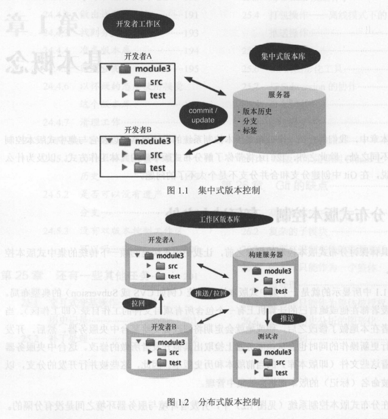
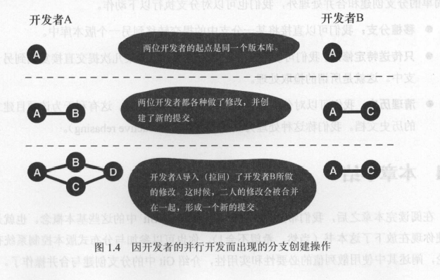
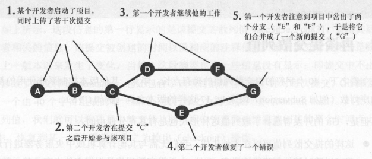
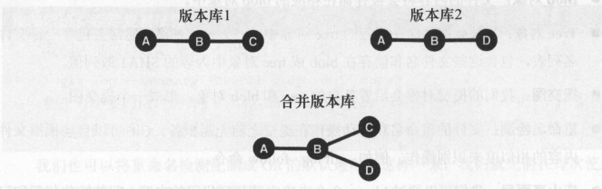
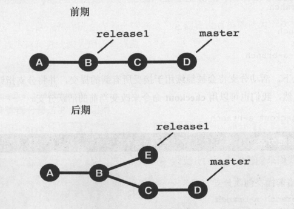

# 第1章 基本概念
在本章中，我们将介绍一个分布式版本控制系统的设计思路，以及它与集中式版本的不同之处。除此之外，我们还将带你了解分布式版本库的具体工作方式，以及为什么我们会说，在git中创建分支和合并分支不是个大不了的问题。
## 1.1分布式管理有何过人之处
- 集中式集中版本管理系统:
每个开发者都在他自己的计算机上有个包含所有项目的工作目录(即工作区)，当该开发者在本地做了修改之后，他会定期的将修改提交给某台中央服务器。然后开发者在执行更新的同时也会从服务器上检索出其他开发者所作出的修改。这台服务器上存储着当前版本和历史版本。因此这种并行开发的分支，以及各种被命名(标记)的版本都将会被集中管理。
- 分布式管理系统:
开发者和与服务器之间是没有分隔的。每一个开发者都同时拥有一个用于当前文件操作的工作区与一个用于存储该项目的所有版本，分支以及标签的本地库(我们称之为克隆)。每个开发者的修改都会被载入成一次次的新版本提交(commit),首先提交到本地版本库中。然后，其他开发者就会立即看到新的版本。通过push和pull命令，我们可以从一个版本库传递到另一个版本库中。这样看来，从技术上来看，这里所有的版本库在分布式架构上的地位是等同的。因此从理论上讲，我们不需要借助服务器，就可以将某一台开发机上所作的所有修改直接传递给另一台开发工作机。当然在具体实践中，git中的服务器版本库也扮演者重要角色。

## 1.2版本库，分布式工作的基础所在
其实，版本库本质就是一个高效的数据存储结构而已，由以下部分组成。
- 文件
- 目录
- 版本
每一个版本所定义的都是相应目录的某个可恢复的状态。每当我们创建一个新的版本时，其作者，时间，注释都会被保存下来。
## 1.3分支的创建和合并

如上图所示，图中开发者的起点是同一个版本。之后两人各自做了修改，并提交了修改。这时候，对于这两位开发者的版本库来说。该项目已经有了两个版本。也就是说，他们在这里创建了两个分支。接下来，如果其中一个开发者想要导入另一个人的修改。他就可以用git来进行版本合并，如果合并成功了，git就会创建一个合并提交，其中会包含两位开发者所作出的修改。这时如果另一位开发者也取回了这一提交，两位开发者的项目就又回到了同一版本。
在上面的例子中，分支的创建是非计划性的，其原因仅仅是两个开发者在并行开发同一个软件罢了。在git中，我们也可以开启有针对性的分支。即显示的创建一个分支。显示分支通常主要用于协调某一种功能性的并行开发。
版本库在执行拉回和推送操作时，可以具体指定其针对的是哪个分支。当然，除了这些简单的分支创建和合并操作外，我们也可以执行以下操作。
- 移植分支:我们可以直接将某一分支移交到另一个版本库中。
- 只传送特定的修改
- 清理历史
# 第2章 入门
如果你试着想用一下git，那么我们马上就可以开始了。本章会带领你创建一个自己的第一个项目。我们会为你演示那些用于提交修改版本，查看历史和与其他开发者交换版本的命令。
## 2.1 准备git环境
首先我们要先安装好git
git是一个高可配置软件。首先我们可以宣布用config命令配置下用户和邮箱。
```c
git config --global user.email "867482924@qq.com"
git config --global user.name "zhang_kaidong"
```

```c
git config --local --list 查看本地设置
git config user.name/email 查看邮箱和用户名

```
开始摆弄这个玩具项目之前，我们建议你最好做一个备份。尽管在git中，想要造成永久性的删除或者破坏也不是件容易的事情，而且每当你做错出某些危险动作的时候，git通常也会发出相应的警告消息。但是，有备无患总是好的。
### 2.2.1创建版本库
现在，我们首先创建一个版本库，用于存储该项目本身及其历史。为此，我们需要在该项目目录中使用init命令。对于一个带版本库的项目目录，我们通常称之为工作区。
```c
git init
```
### 2.2.2首次提交
接下来，我们需要将foo.txt和bar.txt这两个文件添加到版本库去。在git中，我们通常将项目的一个版本称之为一次提交，但是这要分为两个步骤来实现。第一步，我们先用add命令来确定哪些文件应被包含在下次提交中。第二步，再用commit命令将修改传送到版本库中，并赋予该提交一个散列值以便标识这次提交。
```c
git add foo.txt
git commit --message "frist test"
```
### 2.2.3 检查状态
现在我们修改下foo.txt文件内容，先删除bar.txt文件，再添加一个名为bar.html的新文件。然后，status命令就会显示出该项目自提交以来发生的所有改变。
```c
git status
```
如果还想看到更多细节内容，也可以通过git命令来显示每个被修改的行。
### 2.2.4 提交修改
接下来，所有的修改都必须先被归档成一次新的提交。我们要对修改过的文件和新文件执行add命令。并对要删除的文件实行rm命令。
```c
git add foo.txt bar.html
git rm bar.txt
```
然后用commit命令提交这些修改
```
git commit --message "some change"
```
### 2.2.5 显示历史
log命令可以显示项目下的历史。所有提交都会按时间顺序排列出来。
```
git log
```
## 2.3 git的协作功能
现在我们已经有了一个存放目录项目文件的工作区，以及存放项目历史版本的版本库。在传统的集中式版本系统中，尽管每个开发者也都拥有属于他自己的工作区，但是所有人都共享一个通用的版本库。而在git中，每个开发者拥有的是一个属于他自己的，自带独立版本库的工作区，因此这已经是一个不依赖与中央服务器的，完整的版本版本控制系统了。开发者们可以通过交换各自版本库的提交来实现项目的合作。下面我们就来做个实验，先创建一个新的工作区，以便我们模拟第二位开发者的活动。
### 2.3.1克隆版本库
我们这位新的开发者首先要有一个属于自己的版本库副本。该版本库包含了所有的原始信息与整个项目的历史信息。下面我们用clone命令来克隆一个克隆体。
```c
git clone /projects/first-steps /projects/first-steps-clone
```
### 2.3.2从另一个版本中获取修改
下面，我们修改下/projects/first-steps/foo.txt文件，并执行以下操作来创建一次提交。
```c
cd /projects/first-steps/
git add foo.txt
git commit --message "a change in the original"
```
现在，新的提交已经被存入原来的first-steps版本中，但其克隆版本库first-steps-clone中依然缺失了这次提交。为了让你更好的理解这一情况，我们看一下first-steps的日志
```c
git log --oneline
```
接下来的步骤中，我们再修改克隆库版本中的"first-steps-clone/bar.html"文件，并执行以下操作。
```c
cd /projects/first-steps-clone
git add bar.html
git commit --message "a change in the clone"
git log --oneline
```
现在，我们在两个版本中各做了一次新的提交。接下来，我们要用pull命令将原版本库中的新提交的传递给它的克隆体。由于之前我们在创建克隆版本库时，原版本的路径已经被存储在它的克隆体中，因此pull命令知道该从哪里去取回新的提交。
```c
/projects/first-steps-clone
git pull
```
pull命令从原版本库中取回了新的修改，将他们与克隆体的本地修改进行了对比，并在工作区中合并了两边的修改，创建了一次新的提交。这个过程就是所谓的合并(merge).
请注意！合并过程在某些情况下可能会带来些冲突。一旦遇到这种情况，git中就不能自行合并了。在这种情况下，我们必须要手动清理一些文件，然后确认提交哪些修改。
在pull，merge的过程完成之后，我们可以用新的log命令来查看结果。这次是日志的图形化版本。
```c
git log --graph
```
### 2.3.3 从任意版本库中取回来修改
在没有参数的情况下，pull命令只能在克隆版本库中发挥作用，因为只有该克隆体中有默认的原版本库的连接。当我们执行pull操作时，我们也可以指定任意版本库的路径。以便从特定开发分支中提取相关修改。
现在，我们将克隆体中的修改pull到原版本库中吧
```c
cd /projects/first-steps
git pull /projects/first-steps-clone master
```
### 2.3.4 创建共享版本库
除了可以用pull命令从其他版本取回相关提交外，我们也可以用push命令提交传送传送给其他版本库。只不过，push命令只适用那些没有开发者在上面开展具体工作的版本库。最好的方法就是建立一个不带工作区的版本库，我们称之为裸板本库。你可以使用clone命令的--bare 选项来创建裸版本库。裸版本库通常可被用来充当开发者们传递提交的汇聚点，以便其他人可以从中拉回他们所作的修改。
```c
git clone --bare /projects/first-steps /projects/first-steps-bare.git
```
### 2.3.5 用push命令上载修改
为了演示push命令的使用，我们需要再次修改以下first-steps/foo.txt,并执行以下操作来创建一次新的提交。
```c
cd  /projectsfirst-steps
git add foo.txt
git commit --message "more changes"
```
接下来，我们就可以使用push命令向共享版本库传送该提交了。该指令的参数要求与pull命令相同，我们需要指定目标版本库的路径及分支。
```c
git push /projects/first-steps-bare.git master
```
### 2.3.6 pull命令：取回修改
现在，为了让克隆版本库也得到相应的修改，我们需要在执行pull命令时指向共享版本库的路径参数。
```c
cd /projects/first-steps-clone
git pull /projects/first-steps-bare.git master
```
## 第3章 提交究竟是什么
在git中，提交无疑是最重要的概念了。git管理是软件版本，而版本库中的版本是以提交的形式保存的。某一次的提交的范围通常是整个项目，即通过一次提交。该项目中的每个文件都被存入了版本库中。
下面，我们通过git log --stat -1
```c
git log --stat -1
```
针对每次提交，git都会为其计算一个由40个字符组成的唯一编码，我们称之为提交散列值。只要知道这个散列值，我们就可以将该项目中的文件从版本库中恢复到该提交被创建的那个时间点上。在git中，恢复到某一版本通常称之为checkout操作。
### 3.1 访问权限与时间戳
git会保存每个文件原有的访问权限。但是不会保存文件的修改时间。因此在执行检出操作时，文件的修改时间会被设置为当前时间。
### 3.2 add命令与commit命令
通常，提交中会包含当前所有的修改，既有新增文件也有被删除的文件。唯有例外的是在.gitignore文件中列出的那些文件。
```c
git add --all
git commit
```
### 3.3 再谈提交散列值
乍看之下，40个字符的提交散列值的确有点长。但是，git的开发者选择散列值这种形式也是有充分理由的。
- 这样的提交散列值可以在本地生成。我们无需与其他计算机或中央服务器进行同通信，就可以随时随地的创建新的提交。
- 甚至更为重要的是，提交散列值中的信息要比单纯一个软件版本的名称要多的多。
当然，我们也可以在指定某个提交散列值时采用缩写形式。大致上只要指定几个足以识别该提交的字符就可以了。但是如果指定的字符太少，git还是要报错的。
```c
git checkout 60d6d9d0e852602ce85d0254522b477276e5039c
git checkout 60d6d9
```
另外，我们也可以为某个提交起一个有意义的名称(例如release-1.2.3)。这就是所谓的标记。
```c
git checkout release-1.2.3
```
### 3.4 提交历史
版本库中所包含的并不仅仅是一个个独立的提交，它同时也存储了这些提交之间的关系。每当我们修改了软件并确认提交时，git就会记下这个提交前的版本。

有趣的是，每当有多个开发者同时开发一款软件时，其中的分支在创建时会如提交关系图中的c开始，随后又会如g处那样被合并。
### 3.5 一种略有不同的提交查看方法
我们可以将一次提交看成一个已被冻结的版本层次，但也可以将其视为自上次提交以来项目中所纳入的一组修改。当然，我们也可以将其说成是一种差异集或者一组修改。所以版本库实际上也是一部项目的修改历史。
```c
按部就班:提交之间的差异比较
通过diff命令，我们可以比较两次提交之间的差异
a.两次提交
两次提交之间可以有一份完整的差异清单。我们在不用提交散列值的情况下，靠指定的相关特定符号名称也可以获取到它
git diff 60d6d9d0 HEAD
b.与上一次提交进行比较
通过diff命令中使用^!,我们可以比较当前提价与上次提交之间的差异。
git diff 60d6d9d0^!
c. 限制文件范围
我们可以限制只显示哪些文件或目录之间的差异
git diff 60d6d9d0 85ded81 - book/bisection/
d. 统计修改情况
或者我们可以通过--stat选项来显示每个文件中的修改数量
git diff 60d6d9d0 85ded81 --stat
```
### 3.6 同一个项目的多部不同历史
首先，我们需适应git的分布式架构，在集中式版本控制系统中，通常会存在一个用于存储项目历史的中央服务器。但是在git中，每个开发者都有一个属于自己的版本库克隆体。当开发者创建提交时，通常是本地完成这一动作的。而自此以后，它的版本库就有了一部不同其他开发者版本库的历史。尽管这些人克隆的是同一个项目。
这样一来，每个版本都有一个属于它自己的版本库，这些版本库之间可以通过fetch，pull，以及push命令来共享彼此的提交。除此之外，你也可以用merge命令将这些不同的历史重新合并在一起。
在许多项目中，我们通常会有一个用于存储官方历史的版本库(它通常位于项目服务器上)，我们称该版本为项目版本库。但是这仅仅是一个习惯做法而已，单纯从技术角度来看的话，该项目的所有克隆体都是平等的。
### 3.6.1 部分输出 -n
该选项通常用于限制输出。例如下列这个命令只显示该项目的最后3次提交
```c
git log -n3
```
### 3.6.2 格式化输出
对于日志的输出格式，我们可以用--format选项来控制，例如--format=fuller选项可以用来显示更多的详细信息。而下面则是--oneline选项显示出的概述信息。
```c
git log --oneline
```
### 3.6.3 统计修改信息 --stat --shortstat
统计类选项也是很有用的：--stat可以用来显示被修改的那些文件。--dirstat则可以用来显示那些包含被修改文件的目录。而--shortstat则用来显示项目中有多少文件被修改。以及新增或删除了多少文件。
```c
git log --shortstat --oneline
```
### 日志选项 --graph
我们也可以用来--graph选项来显示各个提交之间的关系。
```c
git log --graph --oneline
```
# 第4章 多次提交
新的提交未必一定得包含工作区中所发生的所有修改。事实上在这一方面，git赋予了用户完全的控制权。甚至，我们可以用它来摘取合并其中的一些更改，并将其纳入下一次提交中。
提交的产生通常被分为两个步骤，首先，我们要用add将所有相关的修改纳入一个缓冲区中。这个缓冲区通常被叫做暂存区或索引。接着，我们才能有commit命令暂存区中的修改传送到版本库中。
## 4.1 status命令
通过status命令，我们可以查看当前工作区中所发生的修改，以及其中的哪些修改已经被注册到了暂存区中，以作为下次提交的内容。
```c
git status
```
这段输出可分为以下几个小标题来显示
- 被提交的修改  changes to be committed
- 不会被更新的修改 changed but not updated
- 未被跟踪的文件 untracked files
除此之外，git还提供相关的帮助提示，告诉我们应该用什么命令来改变这些状态。例如，我们可以用以下命令将blah.txt移除暂存区。
```c
git reset HEAD blah.txt
```
## 4.2 存储在暂存区中的快照
关于暂存区，我们需知道一件事：它的作用不仅仅是为下次提交提供一份文件清单。暂存区不仅要存储修改发生的位置，同时也要存储修改的内容。为了达到这一目的，git必须要为那些被选出的文件生成一个快照。
```c
我们所做的修改是通过add命令被注册到下次提交中的。在那以后，当工作区中发生进一步修改时，我们就可以用diff命令来一探究竟。
a.暂存区中的是什么
对于已经被add命令放入暂存区的那些修改，我们可以通过--staged 选项来显示暂存中的内容。下面命令所要显示当前版本库中的HEAD提交与暂存区之间的不同之处
git diff --staged # staging vs. repository
```
## 4.3 怎么的修改不该被提交
事实上，有些特定的修改是我们确实不想提交的，其中包括以下几种
- 为调试而做的实验性修改
- 意外添加的修改
- 尚未准备好的修改
- 自动生成文件中所发生的修改
```c
按部就班：从暂存中撤回修改
reset 命令可以重置暂存区。其第一个参数为HEAD，表示的是我们要将其重置为当前的HEAD版本。第二个参数则用来指定要被重置的文件或目录，例如
git reset HEAD
git reset HEAD foo.txt src/test/
```
在重置过程中，暂存区将会被重写。这在通常情况下不会是一个问题，因为相同的修该改很可能仍然会保存在工作区中。但是如果这个相同的文件在add命令之后已经被修改过了，那么相关信息就很可能被丢掉了。
- 使用reset命令重置那些实验性的或者被意外修改的内容
- 将我们不希望被提交的忽略文件列表写入.gitignore
- 使用stash命令将我们希望日后在提交的修改内容暂时保存起来。
## 4.4 用.gitignore忽略非版本控制文件
在一般情况下，对于那些自动生成的文件，由编译器创建或用于备份临时文件，我们不会希望将它们置于版本控制之下的。事实上，我们可以通过项目根目录下的.gitignore文件中添加条目的方式让git看不见这些文件。我们可以在该文件中指定这些文件路径和目录，并且可以使用"*"和"&"等通配符。关于路径的指定，我们需要知道：即使我们在该文件中写的是generated/这样简单的路径，也会将所有包含这一名字的目录包含在内,例如src/demo/generated,都会被彻底忽略。但是我们在这类路径之前加个/，例如/generated/,那么就只有这个确切的路径会被忽略了。
另外，我们也可以在项目的子目录中创建一个.gitignore文件。这样一来，该文件就只能影响该目录下的文件和路径了。这在某些情况下可能是有用的，例如，如果我们的项目是用多种语言编写的，那么它们各自都应该有一个不同的配置文件。
但是，请注意，.gitignore文件中的条目只能影响那些还未交给由git来管理的文件。如果其中的某个文件已经被现有版本包含了，那么status命令依然会显示该文件之上发出的所有修改。并且他也可以通过add命令被注册下次提交中。如果我们忽略一个已经被版本化的文件，可以通过update-index命令的--assume-unchanged选项来做到这一点。
## 4.5 储藏
如果我们在某些事情进行到中间的时候，突然发现自己需要快速修复某个问题。这时候，我们通常会希望立即着手去做相关的修改。但是同时先不提交之前一直在做的的事情。这种情况下，我们可以用stash命令先将这些修改保存在本地。日后来处理。
```c
我们通过stash命令将工作区和暂存区的修改保存在一个被我们称之为储藏栈的缓冲区中
git stash
按部就班：恢复被储藏的修改
a.恢复位于栈顶的被储藏修改 
git stash pop
b1.储藏堆栈中有什么
git stash list

git stash pop stash@(1)

```
# 第5章 版本库
事实上，我们即使不了解版本库的具体工作方式，也可以将git用的风生水起。但是如果我们了解了git存储和组织数据的方式，就能对工作流有一个更好的理解。
git主要由两个层面构成。其顶层结构就是我们所用的命令。例如log，commit。这些命令使用起来很方便，并提供了许多可调用的选项。git的开发者称他们为瓷质命令。
.................................
# 第6章 分支
对于版本提交为什么不能依次进行，以便形成一条直线型的提交历史记录，我们认为有以下两个重要原因。
- 有两个以上的开发者在对同一个项目进行并形式开发
- 为修复旧版本中的bug而必须要创建和发布新的版本
如果遇到以上两种情况，我们的提交历史图就会出现分叉的情况
## 6.1 并行式开发
当有多个开发者用git处理同一个软甲开发项目时，他们就会在版本库中创建各自的分支。下面我们来看下图，其上半部分所显示的是两个独立开发者在各自版本地版本库中，基于B成成功的创建了各自的版本。而下半部分，你将看到的他们合并之后的版本库。正如你所见，它创建了一个分支，这种类型的分叉在并行式开发中是难免的

## 6.2 修复旧版本的bug
正如我们之前所说，分支可能会因并行开发的需要而创建。但是除此之外，他也有可能会因修复软件旧版中的bug而创建。
## 6.3 分支
下面来看图，我们一方面在release1这一当前发行版上继续当前开发分支master上的工作。随着各伦新的提交，该分支始终处于活跃向前的状态。而另一方面，我们会看到release1分支从右边岔开了，他对自身bug进行了修复。

## 6.4 泳道
分支可以看作是开发过程中的并行线，我们可以把该提交图想象成游泳池中的泳道。
请注意:git并不知道某次提交是否被分给了某个分支，划分泳道在这里某些程度上来说算是一种比喻性的说法。
## 6.5 当前活跃分支
在一个git版本库中，总是唯一存在着一个活动分支。我们可以用brach命令来列出当前所有分支，其中*号凸显的就是当前分支。
```c
git branch

```
一般情况下，活动分支会被继续用于接受所有新的提交，并将分支指针移动到最近的那个提交。当然我们可以用checkout命令来改变当前的活跃分支。
```c
git checkout a-branch
```
```c
按部就班:创建分支
1a. 下面我们来创建一个新的分支
git branch a-branch

1b. 为任意一批提交创建分支
我们也可以为任意一批提交创建新的分支，为此，我们必须要指定该分支上的第一次提交。
git branch still-a-branch 35sdfse

1c. 从现有分支中创建分支
git branch still-a-branch older-branch
2. 切换到新分支
branch 命令只能用于创建新的分支，但不会自动切换到该新分支上。如果我们想要切到新分支上，就得使用checkout 命令
git checkout a-branch
快捷方式
git checkout -b a-branch
```
```c
按部就班:checout 操作被拒绝时该怎么办
通常情况下，我们可以用checkout命令在分支之间来回切换。但是，如果这时候工作区还存在着一些修改，我们就必须先决定好如何处理这部分修改。
1. 进行checkout
下面这个checkout 很可能会被拒绝
git checkout a-branch
如你所见，工作区或暂存区存在着一些修改，它们还没有被确认为一次提交，所以必须先解决以下何种方式来处理这些修改。
2a. 提交修改并切换

git commit --all
git checkout a-branch

2b. 放弃这些修改并进行切换
我们可以用--force选项进行强制切换，但这样会令这部分修改被覆盖

git checkout --force a-branch

2c. 储藏修改并切换
我们可以用stash命令，先将这部分储藏起来，然后再进行切换。之后再用stash pop命令来恢复它们

git stash
git checkout a-branch
```
## 6.6 重置分支指针
分支指针主要用于指向活动分支，它会每次提交时移动到最新的提交上。因此在通常情况下，我们几乎不太需要去直接设置分支指针。但偶尔我们也会因为一些偶尔事件而失去对该指针的跟踪，想要将其恢复到之前的状态。这种情况下可以用reset命令来重置指针。
```c
git reset --hard 3dd2fs2
```
这样一来，该指针就被重置到了提交3dd2fs2所在的分支上。其中--hard选项用于确保工作区和暂存区也都会被设置都提交3dd2fs2的状态。
需要提醒的是，reset --hard命令会覆盖当前工作区和暂存区中的所有更改。所以最好在执行重置之前先用git stash命令存储一下这些修改。
## 6.7 删除分支
```c
按部就班：删除分支
我们可以通过branch -d 命令来删除分支
a. 删除一个已被终止的分支
git branch -d  b-branch
b. 删除一个已经被终止的分支
如果我们在试图删除一个分支时自己还未转移到不同分支(如master分支)上，git就会给出一个警告，并拒绝该删除操作。如果你还坚持删除该分支的话，就需要在命令中使用-D选项
git branch -D b-branch
```
```c
按部就班:恢复被删除分支
git会自行负责分支的管理，所以当我们删除一个分支时，git只是删除了指向相关提交的指针，但是该提交对象依然会被留在版本库中。因此，如果我们知道删除分支值信息，就可以将某个已删除的分支恢复过来。
a. (在已知提交散列值的情况下)恢复某个分支
git branch a-branch 5555dss
b. 先确定相关的提交散列值
如果我们不知道想要恢复分支的提交散列值，可以reflog命令将他找出来
git reflog
b2. 恢复该分支
git brach b-branch dsfsfs

```
## 6.8 清理提交对象
gc 命令(指的是垃圾回收)可用于清理版本库，移除所有不属于当前分支的提交对象。如果我们想进一步净化自己的版本库，可以先将它克隆一份，并删除其原版本库。

# 第7章 合并分支
使用merge命令来进行分支合并是git中最重要的操作之一。虽然这一操作的底层算法很复杂，但调用起来却很简单。我们可以通过指定分支名称来选择待合并修改的分支。然后，git会基于合并的内容来创建一次新的提交。
下面看这个例子：在一群开发者在一个名为feature分支上开发新功能时，另一个开发者刚刚修复了master分支上的某个错误(提交E),然后过了不久，feature部分的任务也完成了，并将交付使用。因此master分支的下一个版本应该同时包含被修复的部分和新的feature部分。这时候，我们对这些分支使用merge命令，其结果会产生一次合并提交(即这里的提交F),该提交将会有两个父级提交(D和E)

```c
## one the branch master

git merge feature
```
## 7.1 合并过程中发生的事
git 的设计目标之一就是为了能让开发者之间的分布式协作变得尽可能容易一些。因此从很大程度上来说，merge命令应能自动对分支进行合并，完全不需要用户交互。
## 7.2 冲突
git非常适合于在几个开发者对同一软件做多处时，被用来合并它们对程序源代码中所作出的修改。这些操作甚至常会涉及到那些受移动或者重命名影响的文件。而不幸的是，这些文件往往会引发一些无法使用git自动解决的冲突。
- 编辑冲突: 通常发生在两个开发者对同一行代码做了不同修改的时候。这种情况下，git往往无法自行确定两种修改中的哪一种才是正确的。
- 内容冲突：通常发生在两个开发者对某分代码的几个部分做出各自修改的时候。例如这种情况就容易导致这类冲突:当一个开发者在修改某一函数的时候，另一个开发者也在同一时间修改了同一函数。
